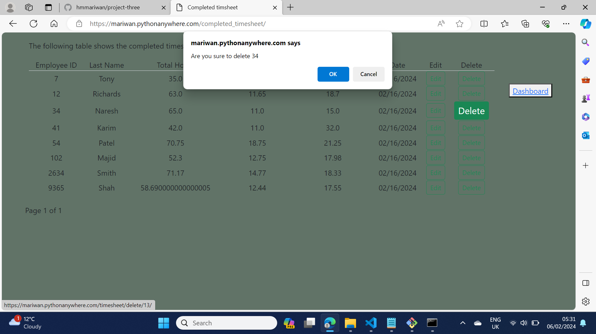
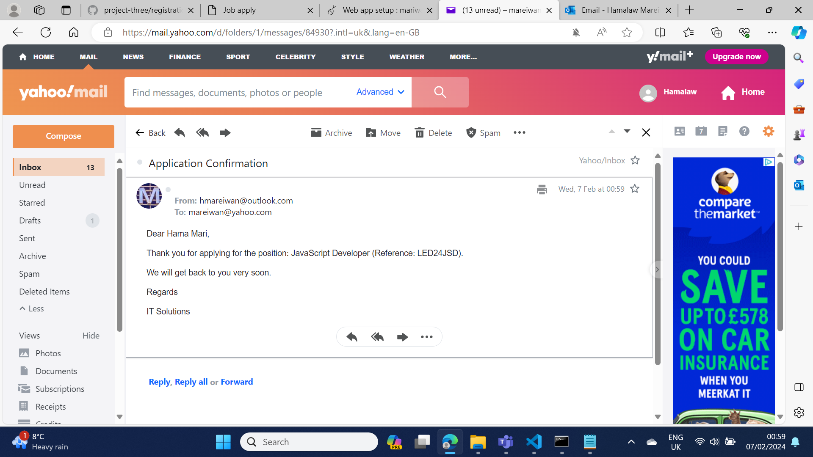

# IT Staffing Solutions

IT Staffing Solutions is a website that connects an employer and a candidate or job seeker. The employer will need to create an account to access all databases such as Employees, Timsheets and Jobs. The employer will be able to register a candidate by giving a unique ID, creating a timesheet and job advertisment. The registered candidate will be able to view their pay slip by entering their email and date of birth on the pay slip page. The job seeker will be able to apply for a job and receive a confirmation. The website allows the user to send an online form to the employer and receive a confirmation email. The below image shows how the databases are connected.
  

  
Employer successfully signed up
  

  
Employer successfully logged in
  

The employer entered incorrect data

The employer entered their email to reset the password

An email was sent to the employer to reset their password

The employer received the email to reset their password

The employer successfully reset the password

Employer registered an employee

 

An employee was added to the database

The employee registration was rejected because the ID was given to another employee

 

The employee registration was rejected because the ID was not a number

 

The employer was asked to confirm deleting an employee

 

The deletion was successful

The employer updated the employee's details

The employer created a timesheet

The timesheet was saved

The timesheet was not created

The timesheet was updated

The employer was asked to delete the timesheet

The timesheet was deleted

All stored pay slips

The candidate created an account

The candidate successfully signed up

The candidate successfully logged in

The candidate changed his profile

The candidate downloaded a file

The candidate accessed to the pay slip

The candidate entered the incorrect email to view the pay slip

The date of birth was incorrect to access the pay slip

The candidate successfully logged in to view the pay slip

The candidate downloaded the pay slip

A new job was created

The employer could not make a new job form because the reference was unique

The list of jobs

The job was deleted

Lateast job

The job details

The candidate applied for a job

The candidate received a confirmation email of the job application form

The employer received an email for a job submission form

The job seeker contacted the employer

The contact form submission was successful

The job seeker received a confirmation email about submitting an online form

The employer received an email from the job seeker

