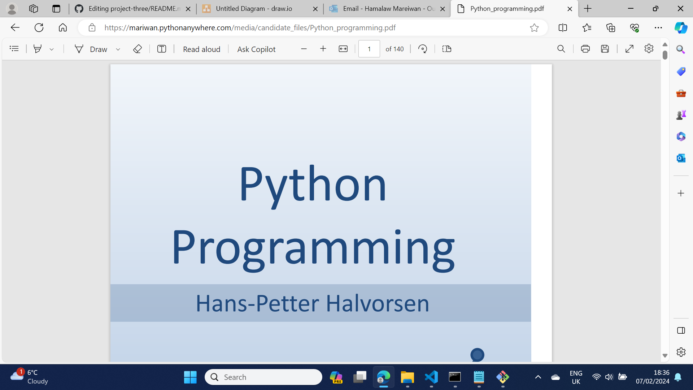
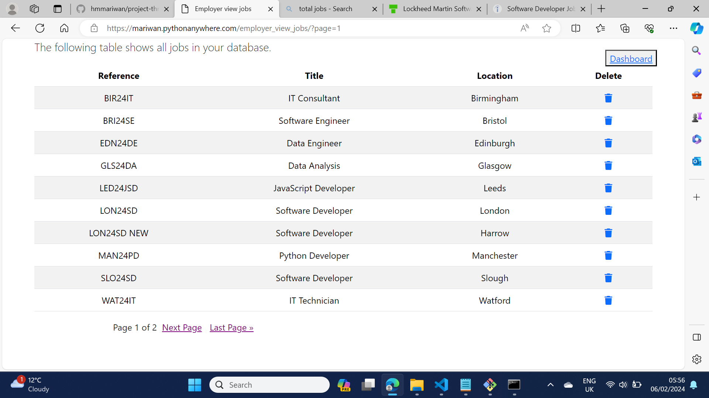

# IT Staffing Solutions

IT Staffing Solutions is a website that connects an employer and a candidate or job seeker. The employer will need to create an account to access all databases such as Employees, Timsheets and Jobs. The employer will be able to register a candidate by giving a unique ID, creating a timesheet and job advertisment. The registered candidate will be able to view their pay slip by entering their email and date of birth on the pay slip page. The job seeker will be able to apply for a job and receive a confirmation. The website allows the user to send an online form to the employer and receive a confirmation email. The below image shows how the databases are connected.
  

  
Employer successfully signed up
  

  
Employer successfully logged in
  

The employer entered incorrect data

The employer entered their email to reset the password

An email was sent to the employer to reset their password

The employer received the email to reset their password

The employer successfully reset the password

Employer registered an employee

 

An employee was added to the database

The employee registration was rejected because the ID was given to another employee

 

The employee registration was rejected because the ID was not a number

 

The employer was asked to confirm deleting an employee

 

The deletion was successful

The employer updated the employee's details

The employer created a timesheet

The timesheet was saved

The timesheet was not created

The timesheet was updated

The employer was asked to delete the timesheet

The timesheet was deleted

All stored pay slips

The candidate created an account

The candidate successfully signed up

The candidate successfully logged in

The candidate changed his profile

The candidate downloaded a file

The candidate accessed to the pay slip

The candidate entered the incorrect email to view the pay slip

The date of birth was incorrect to access the pay slip

The candidate successfully logged in to view the pay slip

The candidate downloaded the pay slip

A new job was created

The employer could not make a new job form because the reference was unique

The list of jobs

The job was deleted

Lateast job

The job details

The candidate applied for a job

The candidate received a confirmation email of the job application form

The employer received an email for a job submission form

The job seeker contacted the employer

The contact form submission was successful

The job seeker received a confirmation email about submitting an online form

The employer received an email from the job seeker

## Testing 
* In the base.html file, I created a section for an online form, some achievements of the practice and a button that helps the patient to make an appointment. I could use the ‘extends’ template tag to bring all the required codes to a child template or exclude a specific block if I wanted.  
* I had a problem with overlapping of contents in the project. Whenever I reduced the size of the screen, the appointment’s button which was in the header overlapped the telephone and email icons. The problem were repeated in every pages so I used a media query to fix the issue.   
* I created two tables which were adjacent to each other to show the costs of different treatments in the Fees & Finance page, but for a small screen, the right table overlapped the left one, so I changed the value of the property ‘Display’ to ‘Grid’ to fix the issue.  
* The Font Awesome icon did not appear on the position, although I included its link in the head section, so I tried another icon.   
* The first time, I used an external CSS style, but the style of the form, button and page were not changed so I used an internal CSS style which changed the appearance of the page. I found that I incorrectly wrote the path of CSS file, in the link tag.

## Unfixed bugs  
In the project, I used Django to send an email to the owner of the website and the user after submitting an online form. When I run a program at http://127.0.0.1:8000/, the owner and the user received the email.   
I also used PythonAnywhere to deploy the website which worked, but when the user submitted the online form, I received the below error, then when I went back to the previous page, the successful message of submitting the form was shown on the website. I was unable to fix this problem because I think I have a free account with them.

## Content  
* I got the contents of the site form Zental Dental Practice.  
* I used the Font Awsome icon for the dropdown menu and staff.  
* I used Google Font for the calendar icon.  
* W3Schools and AI generator helped with converting the design of the page from large screen to small screen.  

## Media  
*I used Google to get all images and logos.  
*The video is from You Tube.  
